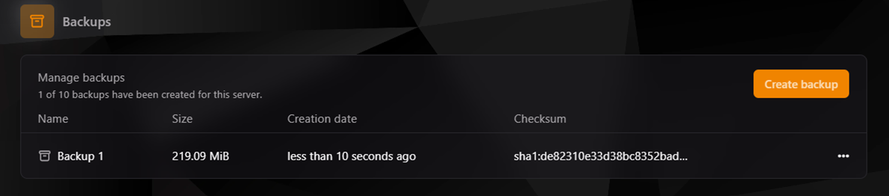
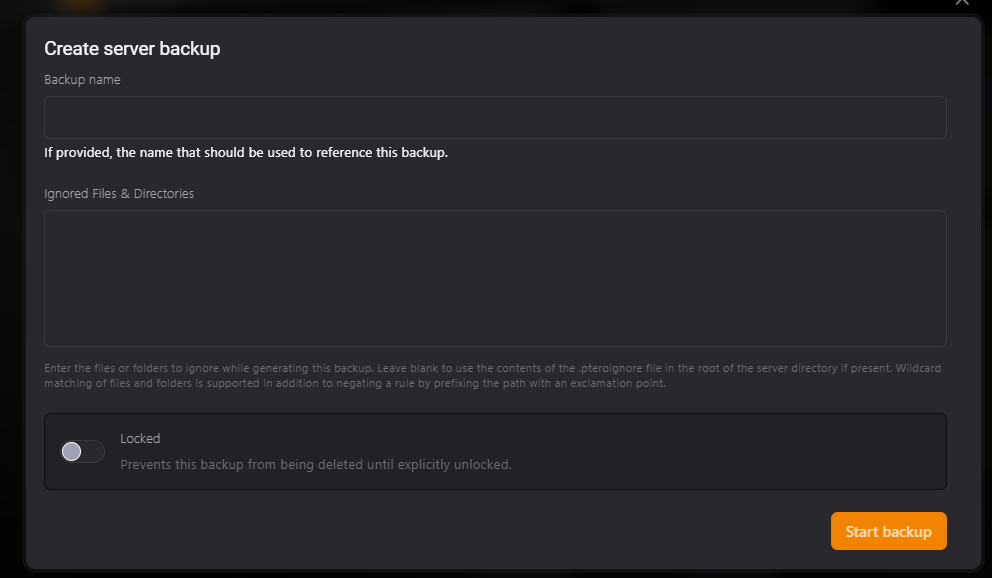

## Copias de Seguridad en TCP

:::info
Las copias de seguridad son esenciales para garantizar la integridad y seguridad de tus datos en el TCP. Permiten restaurar tu servidor a un estado anterior, lo cual es especialmente útil en caso de errores, pérdidas de datos o simplemente para revertir cambios. Es altamente recomendable realizar copias de seguridad antes de hacer cambios significativos en tu servidor.
:::

---

### **1. Acceso al Apartado de Copias de Seguridad**

1. Ve a la sección **Backups** en el TCP.
2. Desde esta sección, podrás ver todas las copias de seguridad existentes y crear nuevas.



---

### **2. Crear una Nueva Copia de Seguridad**

Para crear una nueva copia de seguridad:

1. Haz clic en **Create Backup** para abrir la interfaz de creación.
2. Rellena los siguientes campos:
    - **Backup Name:** (Opcional) Ingresa un nombre para identificar la copia de seguridad.
    - **Ignored Files & Directories:** (Opcional) Especifica archivos o carpetas que deseas excluir. Si no se especifica nada, se usarán los contenidos del archivo `.pteroignore`, si está presente.
    - **Locked:** Activa esta opción para evitar que la copia sea eliminada accidentalmente.



3. Haz clic en **Start Backup** para comenzar el proceso.

---

### **3. Visualización de Copias de Seguridad**

Una vez creada la copia de seguridad, esta aparecerá en la lista de copias disponibles. La información mostrada incluye:
- **Nombre de la copia de seguridad.**
- **Tamaño de la copia.**
- **Fecha de creación.**
- **Checksum (SHA1) para verificar la integridad del archivo.**

Desde esta vista, también puedes realizar acciones adicionales como descargar, restaurar, bloquear o eliminar la copia de seguridad.

---

### **4. Configuración del Archivo `.pteroignore`**

El archivo `.pteroignore` permite excluir archivos y directorios específicos de las copias de seguridad. Funciona de manera similar al archivo `.gitignore` en Git. Cada línea en el archivo especifica un patrón de exclusión.

#### Ejemplo de un archivo `.pteroignore`:
```plaintext
# Ignorar todo el directorio logs
logs/

# Ignorar todos los archivos .temp
*.temp

# Incluir específicamente un archivo llamado important.temp
!important.temp

# Ignorar el directorio backups
backups/

# Ignorar todos los archivos .bak
*.bak