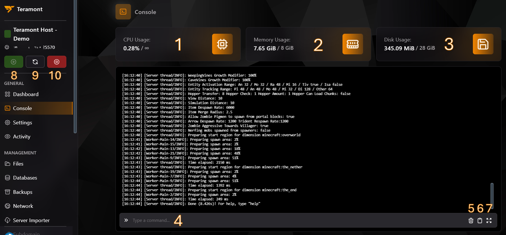
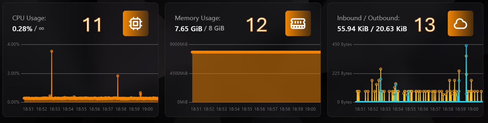

## Controles básicos del panel en la sección "Consola"

A continuación, te presentamos una guía visual de los controles básicos que encontrarás en la sección "Consola" de nuestro panel:

:::info
**Descripción de los controles:**
:::

1. **Uso del CPU**: Muestra en tiempo real el consumo de CPU de tu servidor.
2. **Uso de RAM**: Indica en tiempo real la memoria RAM utilizada por tu servidor.
3. **Uso de almacenamiento**: Muestra en tiempo real el espacio de almacenamiento utilizado por tu servidor.
4. **Centro de comandos**: Desde aquí, puedes enviar comandos directamente a la consola de tu servidor.
5. **Limpiar consola**: Este botón te permite limpiar la consola para una mejor visualización.
6. **Copiar registros**: Este botón te permite copiar las últimas líneas de la consola a [mclo.gs](https://mclo.gs) de forma automática.
7. **Expandir consola**: Este botón te permite abrir la consola en una pestaña nueva.

---

## Centro de control

:::info
**⚠️ Esta sección siempre está visible en el panel ⚠️**
:::

**Descripción de los controles:**

8. **Iniciar servidor**: Utiliza este botón para encender tu servidor.
9. **Reiniciar servidor**: Permite reiniciar tu servidor.
10. **Apagar/Forzar cierre**: Utiliza este botón para apagar o forzar el cierre de tu servidor.

---

## Estadísticas avanzadas

En la sección inferior del Dashboard, puedes encontrar gráficos avanzados que te permiten monitorear el rendimiento del servidor en tiempo real.

:::info
**Descripción de los puntos 11, 12 y 13:**
:::

11. **Gráfico de uso del CPU**:
    - Este gráfico muestra el uso de la CPU en intervalos de tiempo específicos.
    - Es ideal para identificar picos en el consumo de recursos que puedan afectar el rendimiento del servidor.

12. **Gráfico de uso de memoria RAM**:
    - Visualiza el consumo de memoria RAM **ASIGNADA A TU INSTANCIA ACTUAL**.
    - Te ayuda a comprender si tu servidor está utilizando toda la memoria asignada o si necesita ajustes.

13. **Gráfico de tráfico de red (Inbound/Outbound)**:
    - Monitorea la actividad de red de tu servidor.
    - Te indica la cantidad de datos entrantes (Inbound) y salientes (Outbound) en cada momento, lo que es útil para analizar patrones de tráfico.

:::info
**Estos gráficos son fundamentales para realizar ajustes proactivos en el servidor y garantizar un rendimiento óptimo.**
:::

---

Si tienes más dudas sobre cómo utilizar las herramientas avanzadas de tu consola o los gráficos de monitoreo, no dudes en contactar con el soporte de Teramont Host. ¡Estamos para ayudarte!