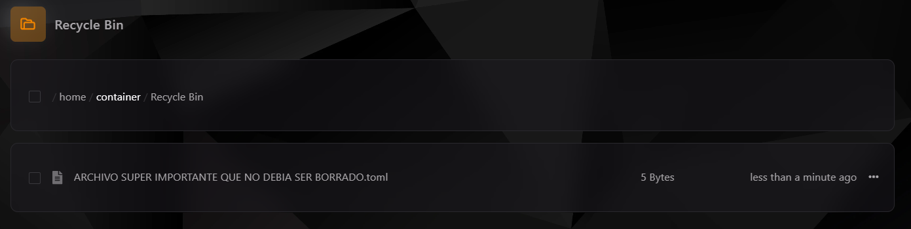

## Introducción al Administrador de archivos

El Administrador de archivos en el **Teramont Control Panel (TCP)** es una herramienta esencial que te permite gestionar, visualizar y modificar los archivos de tu servidor de manera eficiente y sencilla.

---

## Resumen de controles

### **Navegación y gestión básica**

En la parte superior de la interfaz del Administrador de archivos, encontrarás herramientas clave para gestionar los archivos de tu servidor:

1. **Barra de búsqueda de archivos:** Permite buscar archivos o directorios específicos dentro de la ruta actual.
2. **Eliminar archivo seleccionado:** Envía los archivos seleccionados a la papelera de reciclaje.
3. **Mover selección:** Mueve los archivos o carpetas seleccionados a otra ubicación.
4. **Comprimir selección:** Crea un archivo comprimido con los elementos seleccionados.
5. **Descargar desde URL:** Inserta un enlace directo para descargar archivos al servidor.
6. **Crear directorio:** Añade una nueva carpeta en la ruta actual.
7. **Subir archivo al contenedor:** Carga archivos desde tu dispositivo al servidor (límite de 100 MB).
8. **Crear archivo plano:** Crea un nuevo archivo vacío.
9. **Git Clone:** Clona un repositorio Git en la ruta actual.
10. **Git Pull:** Actualiza un repositorio Git existente.

---

### **Acciones individuales para archivos y carpetas**

Al seleccionar un archivo o carpeta y desplegar las opciones, encontrarás herramientas adicionales:

11. **Calcular peso del directorio:** Muestra el tamaño total del directorio seleccionado.
12. **Renombrado rápido:** Cambia el nombre del archivo o carpeta.
13. **Movimiento rápido:** Mueve un archivo o carpeta a una nueva ubicación.
14. **Protección con permisos:** Ajusta los permisos (CHMOD) de un archivo o carpeta.
15. **Compresión rápida:** Crea un archivo comprimido del elemento seleccionado.
16. **Eliminar:** Envía el archivo o carpeta seleccionada a la papelera de reciclaje.

---

## **Permisos en sistemas Unix y Linux**

### ¿Qué son los permisos CHMOD?

Los permisos en sistemas Unix y Linux controlan quién puede acceder a un archivo o directorio y qué acciones pueden realizar. Cada permiso se representa mediante un número que va de 0 a 7:

- **Lectura (Read):** 4
- **Escritura (Write):** 2
- **Ejecución (Execute):** 1

Los permisos se dividen en tres categorías:
1. **Propietario (Owner)**
2. **Grupo (Group)**
3. **Otros (Others)**

Por ejemplo:
- **644:** El propietario puede leer y escribir, mientras que el grupo y otros solo pueden leer.
- **755:** El propietario puede leer, escribir y ejecutar, mientras que el grupo y otros solo pueden leer y ejecutar.

:::info
En el contexto de servidores, los directorios suelen tener permisos "755", mientras que los archivos tienen permisos "644".
:::

Para modificar permisos en TCP, selecciona el archivo o carpeta, elige la opción "Permisos" y especifica el número CHMOD deseado.

---

## Papelera de reciclaje

La papelera de reciclaje permite recuperar archivos eliminados dentro de las últimas 24 horas.

### **Características:**
- Los archivos eliminados se moverán a la papelera en lugar de ser borrados inmediatamente.
- Los archivos permanecen disponibles durante 24 horas.
- Después de 24 horas, los archivos se eliminan de forma permanente.

:::caution
**Importante:** Asegúrate de verificar los elementos en la papelera antes de que se eliminen definitivamente.
:::

---