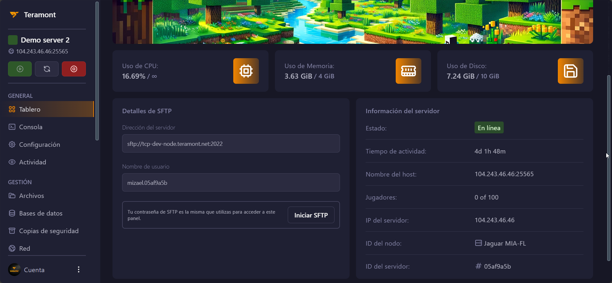

## Introducción a Teramont Control Panel (TCP)

El Teramont Control Panel (TCP) es un poderoso panel de control diseñado para la administración de servidores. Basado en el reconocido panel Pterodactyl y adaptado por Teramont Host para ofrecer una experiencia única y optimizada a nuestros usuarios.

Puedes acceder al TCP desde [panel.teramont.net](https://panel.teramont.net).

## Vistazo General del Servidor

En el Tablero de Teramont Control Panel (TCP), puedes obtener un vistazo general del estado y el rendimiento de tu servidor.

### Uso de Recursos

- **Uso de RAM**: Muestra el porcentaje de memoria RAM utilizada.
- **Uso de CPU**: Indica el porcentaje de uso de la CPU.
- **Uso de Almacenamiento**: Proporciona información sobre el espacio de almacenamiento utilizado.

## Detalles SFTP

Para acceder al servidor a través de SFTP, puedes usar los siguientes detalles:

- **Dirección del Servidor**: [Dirección del servidor]
- **Nombre de Usuario**: [Nombre de usuario]
- **Iniciar SFTP**: Esta función es compatible solo con WinSCP.

:::info
Asegúrate de usar WinSCP para iniciar sesión utilizando SFTP.
:::

## Información del Servidor

- **Estado**: Indica si tu servidor está online o si está offline.
- **Tiempo de Actividad**: Muestra el tiempo de actividad de tu servidor.
- **Nombre del Host**: Muestra el nombre del host del servidor.
- **Jugadores**: (Solo visible para servidores de juegos) Muestra la cantidad de jugadores conectados.
- **IP del Servidor**: Dirección IP pública con la que podrás acceder a tu servidor.
- **ID del Nodo**: Muestra el ID del nodo, ideal para proporcionarlo al pedir soporte.
- **ID del Servidor**: Muestra el ID del servidor, ideal para proporcionarlo al pedir soporte.