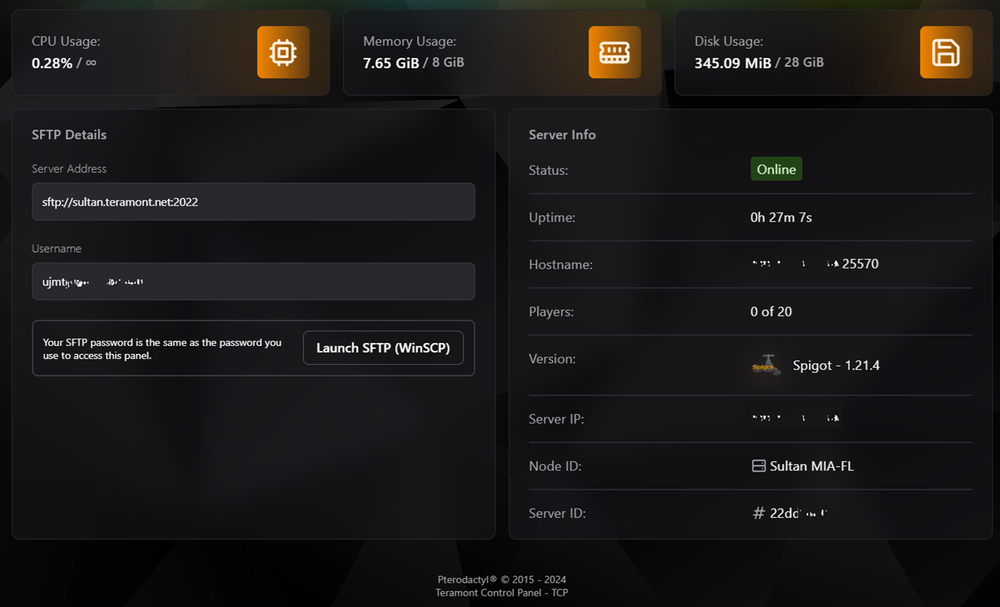

# Bienvenido a Teramont Control Panel (TCP)

El **Teramont Control Panel (TCP)** es una solución robusta y eficiente para la administración de servidores. Basado en el potente panel **Pterodactyl**, ha sido personalizado por **Teramont Host** para brindar una experiencia única que facilita el monitoreo, la gestión y el control de servidores en tiempo real.

Accede a nuestro panel desde: [panel.teramont.net](https://panel.teramont.net).

---

## Funcionalidades Destacadas del Dashboard

El Dashboard del TCP ofrece toda la información clave para monitorear y administrar tu servidor en un solo lugar. Aquí tienes una explicación detallada de cada sección visible:

---

### **1. Monitoreo de Recursos**
En la parte superior del Dashboard, puedes ver estadísticas esenciales de rendimiento:

- **Uso de CPU:** Muestra el porcentaje de carga actual de la CPU en relación a los recursos asignados al servidor.
- **Uso de RAM:** Proporciona una vista en tiempo real de la memoria utilizada frente a la memoria total asignada.
- **Uso de Almacenamiento:** Indica el espacio usado y disponible en el almacenamiento asignado al servidor.

---

### **2. Detalles de Conexión SFTP**
La conexión SFTP te permite administrar los archivos de tu servidor de manera segura. Los campos mostrados incluyen:

- **Dirección del Servidor:** Dirección y puerto para conectarte a través de un cliente SFTP (ej. WinSCP).
- **Nombre de Usuario:** El identificador único asignado a tu servidor.
- **Contraseña:** La contraseña es la misma que utilizas para acceder al panel.

:::info
Recomendamos usar el cliente **[WinSCP](https://winscp.net/eng/index.php)** para mayor compatibilidad y facilidad de uso.
:::

Para iniciar la conexión, haz clic en el botón "Launch SFTP (WinSCP)".

---

### **3. Información del Servidor**
Esta sección ofrece un resumen detallado del estado del servidor y otros datos clave:

- **Estado:** Indica si el servidor está Online u Offline.
- **Tiempo de Actividad (Uptime):** Tiempo total que el servidor lleva funcionando desde el último inicio.
- **Nombre del Host:** Nombre del nodo o ubicación del servidor.
- **Jugadores:** (En servidores de juegos) Muestra la cantidad de jugadores conectados en tiempo real.
- **Versión:** Muestra la versión del software o del juego que corre el servidor.
- **IP del Servidor:** Dirección IP pública utilizada para conectarse al servidor.
- **ID del Nodo:** Identificador del nodo al que está asociado el servidor (útil para soporte técnico).
- **ID del Servidor:** Identificador único del servidor, necesario para cualquier consulta de soporte.

---

## Uso Avanzado del Panel

### **Monitorización Detallada**
Además de los indicadores básicos, el Dashboard puede complementarse con gráficos históricos de uso de CPU, RAM y almacenamiento. Estos gráficos pueden ayudarte a identificar picos de rendimiento y ajustar recursos según sea necesario.

---

## Capturas de Pantalla

A continuación, se incluye una vista previa del Dashboard para que los usuarios puedan familiarizarse con la interfaz.

### Vista General:

---

### **Consejos de Seguridad**
- Nunca compartas tus credenciales de acceso o detalles de conexión SFTP.
- Usa contraseñas seguras y cámbialas regularmente.
- Limita el acceso a usuarios autorizados para evitar configuraciones no deseadas.