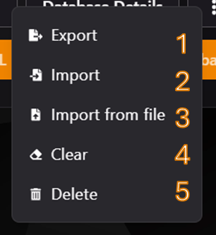

## Apartado MySQL en TCP (Teramont Control Panel)

El **Teramont Control Panel (TCP)** proporciona una herramienta intuitiva para gestionar bases de datos MySQL/MariaDB. Esta sección permite crear, configurar y administrar bases de datos asociadas con tu servidor.

---

### **1. Sección Inicial de Bases de Datos**

La sección inicial muestra un resumen de todas las bases de datos asignadas a tu servidor. Desde aquí, puedes:

- Crear una nueva base de datos haciendo clic en **New Database**.
- Exportar o importar bases de datos en formato SQL.
- Visualizar la lista de bases de datos actuales junto con información básica como:
    - Nombre de la base de datos.
    - Nombre de usuario asociado.
    - Endpoint de conexión.
    - Tamaño de la base de datos.

---

### **2. Detalles de la Base de Datos**

Al seleccionar una base de datos y hacer clic en **Database Details**, accedes a la vista detallada. Esta sección muestra:

- **Endpoint:** Dirección y puerto para conectarte a la base de datos.
- **Connections From:** IPs permitidas para acceder a la base de datos.
- **Username:** Usuario asociado.
- **Password:** Contraseña para acceder a la base de datos.
- **JDBC Connection String:** Cadena de conexión para aplicaciones Java.
- Botón para rotar la contraseña si es necesario.

---

### **3. Exportar una Base de Datos a SQL**

Para exportar una base de datos a formato SQL:

1. Selecciona la base de datos deseada.
2. Haz clic en **Export Database to SQL**.
3. Guarda el archivo SQL generado.

Esta acción es ideal para crear una copia de seguridad o para mover la base de datos a otro entorno.

---

### **4. Importar una Base de Datos desde SQL**

Para importar una base de datos desde un archivo SQL:

1. Selecciona la base de datos a la que deseas importar datos.
2. Haz clic en **Import SQL into Database**.
3. En el formulario de importación:
    - **Wipe Database:** Borra los datos existentes antes de importar.
    - **Remote Import:** Importa desde un host remoto sin necesidad de descargar el archivo localmente.
4. Haz clic en **Import Local SQL into Database** para iniciar el proceso.

---

### **5. Opciones Adicionales de Gestión**

Cada base de datos tiene un menú de opciones adicionales al hacer clic en el ícono correspondiente:

1. **Export:** Descarga la base de datos como un archivo SQL.
2. **Import:** Inicia el proceso de importación de datos.
3. **Import from file:** Permite subir un archivo SQL desde tu dispositivo.
4. **Clear:** Vacía todos los datos de la base de datos.
5. **Delete:** Elimina por completo la base de datos.

---

### **6. Importar desde la Opción del Menú**

Si eliges la opción **Import** desde el menú de acciones rápidas, accederás a una vista detallada para importar datos desde un host remoto. Debes proporcionar:

- **Remote Username:** Usuario del host remoto.
- **Remote Password:** Contraseña para conectarte al host remoto.
- **Remote Host:** Dirección IP o nombre del host remoto.
- **Remote Port:** Puerto de conexión (por defecto 3306).
- **Remote Database Name:** Nombre de la base de datos en el host remoto.

Haz clic en **Import Database** para iniciar el proceso.

---