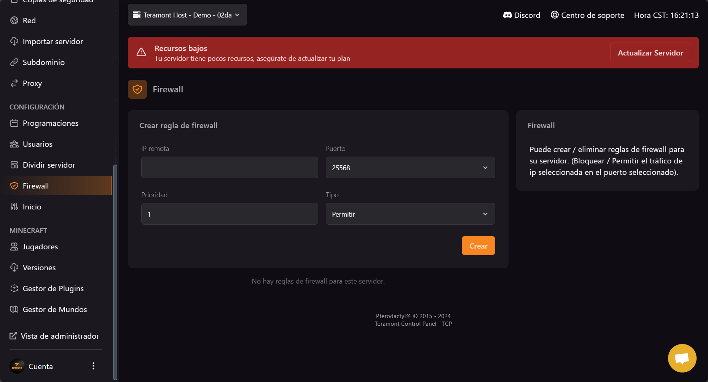
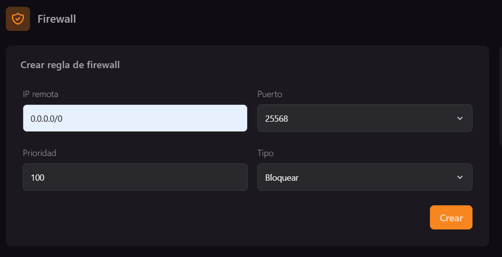
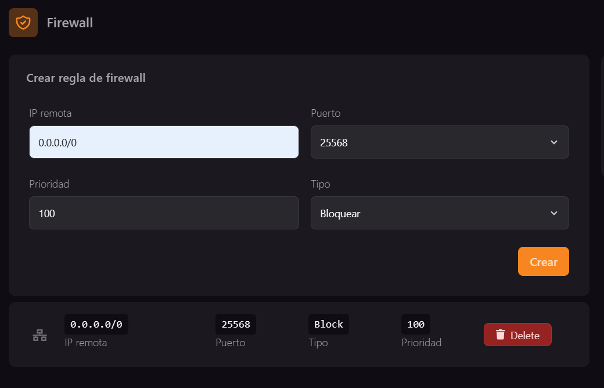

### Configuración del Cortafuegos

El cortafuegos te permite controlar el tráfico entrante y saliente de tu servidor. Puedes establecer reglas para permitir o bloquear conexiones basadas en direcciones IP, puertos, prioridad y tipo de conexión.

:::info
Para bloquear todas las conexiones entrantes y salientes, utiliza la dirección IP `0.0.0.0/0` con prioridad `100` y el tipo de bloqueo.
Para permitir conexiones de direcciones IP específicas, utiliza la dirección IP `x.x.x.x/32` (reemplaza las `x` por la dirección IP deseada), establece una prioridad entre `1` y `99`, y selecciona el tipo de conexión como "Permitir".
:::

#### Campos del Cortafuegos

1. **IP Remota**: Ingresa la dirección IP remota para la cual deseas establecer la regla de cortafuegos.
2. **Puerto**: Especifica el puerto al que se aplicará la regla de cortafuegos.
3. **Prioridad**: Define la prioridad de la regla de cortafuegos. Un valor más bajo indica una prioridad más alta.
4. **Tipo**: Selecciona el tipo de conexión: "Permitir" o "Bloquear".

:::warning
Asegúrate de configurar las reglas de cortafuegos de manera cuidadosa para evitar bloqueos no deseados o permitir accesos no autorizados.
:::

:::tip
Utiliza reglas de cortafuegos para mejorar la seguridad de tu servidor y controlar el tráfico de red según tus necesidades específicas.
:::

## Ejemplo de uso

Si tienes una network y usas el plugin Bungeeguard para evitar que ingresen a tus modalidades sin antes pasar por el proxy, la función del firewall es una opción extra de seguridad y más segura. Supongamos que tienes el plan Performance 20GB contratado y tienes la siguiente distribución:

- Proxy: 2GB
- Lobby: 2GB
- Modalidad 1: 8GB
- Modalidad 2: 8GB

En los servidores Lobby, Modalidad 1 y Modalidad 2, deberás establecer lo siguiente:

Esto hará que no se pueda ingresar de ninguna forma a tu modalidad backend sin antes pasar por tu proxy. Debes repetir esta configuración en todas las modalidades backend y debe quedar de la siguiente manera:

:::warning
Asegúrate de que el servidor proxy no tenga reglas de firewall activas.
:::

:::warning
Esta guía solo funciona si tienes el complemento IP Dedicada y todos tus servidores comparten la misma dirección IP. Planeamos lanzar una guía próximamente para clientes que usen la IP compartida.
:::