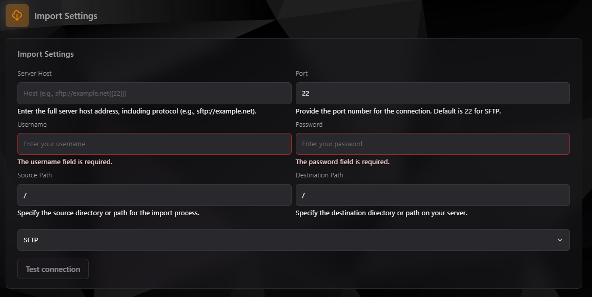

## Importador en TCP

El **Importador** en el **Teramont Control Panel (TCP)** te permite transferir datos de otro servidor o fuente directamente a tu servidor actual. Es una herramienta esencial para migraciones o integraciones rápidas de archivos y configuraciones.

---

### **1. Interfaz del Importador**

La interfaz principal del Importador se encuentra en la sección de configuración del panel. Desde aquí, puedes configurar los parámetros necesarios para importar datos.

---

### **2. Configuración del Proceso de Importación**

#### Campos a completar:

1. **Server Host:** Dirección completa del servidor fuente. Ejemplo: `sftp://example.net`.
    - Incluye el protocolo que vas a usar (como `sftp`).
2. **Port:** Puerto del servidor fuente (por defecto es `22` para SFTP).
3. **Username:** Nombre de usuario necesario para la conexión al servidor fuente.
4. **Password:** Contraseña asociada al nombre de usuario para la autenticación.
5. **Source Path:** Ruta o directorio en el servidor fuente desde donde deseas importar los datos. Ejemplo: `/home/source/`.
6. **Destination Path:** Ruta en tu servidor actual donde se guardarán los datos importados. Ejemplo: `/home/container/`.
7. **Protocolo de Transferencia:** Selecciona entre las opciones disponibles, como SFTP.

#### Opciones Adicionales:
- **Test Connection:** Una vez configurados los campos, usa esta opción para verificar que los datos de conexión son correctos antes de iniciar el proceso de importación.

---

### **3. Pasos para Realizar una Importación**

1. Completa todos los campos necesarios con la información del servidor fuente.
2. Asegúrate de seleccionar correctamente el protocolo de transferencia (SFTP por defecto).
3. Haz clic en **Test Connection** para confirmar que la conexión con el servidor fuente es válida.
4. Si la prueba es exitosa, inicia el proceso de importación seleccionando la opción correspondiente.

---

### **4. Consejos para una Importación Exitosa**

- **Verifica las credenciales:** Asegúrate de que el usuario y la contraseña sean correctos y tengan permisos suficientes para acceder a la ruta fuente.
- **Comprueba la ruta fuente:** Confirma que el directorio especificado existe en el servidor fuente.
- **Asegúrate del espacio disponible:** Verifica que el servidor de destino tiene suficiente espacio para recibir los datos importados.
- **Protocolo correcto:** Por defecto, se utiliza SFTP. Si usas otro protocolo, asegúrate de configurarlo correctamente.

---

### **5. Usos Comunes del Importador**

- Migrar configuraciones desde otro proveedor de hosting.
- Transferir grandes volúmenes de datos entre servidores sin necesidad de descargas locales.
- Sincronizar directorios o configuraciones específicas desde un servidor remoto.

---