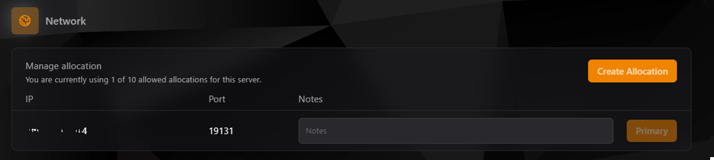
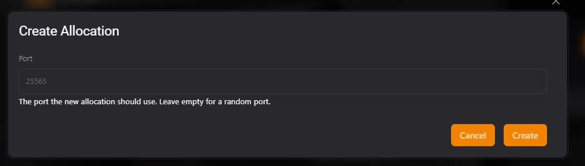

## Apartado de Red en TCP

El **apartado de red** en el **Teramont Control Panel (TCP)** te permite gestionar las asignaciones de puertos e IPs para tu servidor. Esto es especialmente útil para configurar servicios específicos o separar funcionalidades en diferentes puertos.

---

### **1. Vista Inicial del Apartado de Red**

En esta vista, puedes observar todas las asignaciones existentes para tu servidor. Cada asignación incluye:

- **IP:** Dirección IP asignada al servidor.
- **Port:** Puerto asignado.
- **Notes:** Campo opcional para agregar notas descriptivas sobre el propósito del puerto.
- **Primary:** Indica cuál es la asignación principal utilizada por el servidor.

Además, puedes crear nuevas asignaciones haciendo clic en **Create Allocation**.

---

### **2. Crear una Nueva Asignación**

Para añadir una nueva asignación:

1. Haz clic en el botón **Create Allocation**.
2. En el formulario emergente:
   - **Port:** Ingresa el puerto que deseas asignar al servidor. Si no proporcionas un puerto, el sistema seleccionará uno aleatorio.
3. Haz clic en **Create** para confirmar.

#### **Notas sobre la Creación de Asignaciones:**
- El puerto que elijas debe estar disponible y no en uso por otro servicio.
- Puedes usar notas descriptivas para identificar el propósito de cada asignación.
- Asegúrate de no bloquear accidentalmente el puerto asignado en el firewall de tu red.

---

### **3. Configuración de Asignaciones**

Cada asignación en la lista tiene las siguientes funcionalidades:

- **Editar Notas:** Agrega o modifica una descripción para identificar el propósito de la asignación.
- **Establecer como Primario:** Cambia la asignación principal del servidor a otra IP o puerto de la lista.
- **Eliminar:** Si una asignación ya no es necesaria, puedes eliminarla para liberar recursos.

---

## **Importancia de la Configuración de Red**

La configuración correcta de las asignaciones de red asegura que los usuarios puedan conectarse al servidor sin problemas. Además, la gestión eficiente de puertos permite:

- Segmentar servicios específicos en diferentes puertos.
- Reducir conflictos de red con otras aplicaciones.
- Mejorar la seguridad al limitar las asignaciones innecesarias.

---

### **Ejemplo de Uso**

Imagina que tienes un servidor con múltiples servicios:
- Puerto principal para el juego: **19131**
- Puerto secundario para ItemsAdder: **25590**

Con el apartado de red del TCP, puedes gestionar estas asignaciones fácilmente, asegurándote de que cada servicio opere en su puerto designado.
---