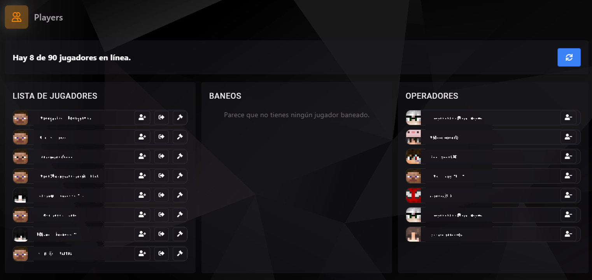

### Gestión de Jugadores

La sección de **Players** en el panel TCP permite a los administradores del servidor gestionar a los jugadores conectados, revisar baneo de usuarios y administrar la lista de operadores (OPs). Este módulo facilita la administración activa de la comunidad y el mantenimiento de un entorno seguro para el servidor.

---

#### Funcionalidades Principales

1. **Lista de Jugadores Conectados**:
   - Muestra a todos los jugadores actualmente conectados al servidor.
   - Información detallada de cada jugador, incluyendo su nombre de usuario y estado de conexión.
   - Opciones rápidas:
     - **Añadir a Operadores**: Eleva al jugador a OP directamente desde la lista.
     - **Expulsar**: Desconecta a un jugador del servidor.
     - **Banear**: Bloquea el acceso del jugador al servidor de forma permanente o temporal.

2. **Baneos**:
   - Visualiza la lista de jugadores actualmente baneados.
   - Opciones disponibles para desbanear a usuarios desde esta sección.
   - Ideal para mantener el control sobre las sanciones aplicadas y revisarlas regularmente.

3. **Operadores**:
   - Lista de todos los jugadores con permisos de OP (Operadores).
   - Permite añadir o remover operadores rápidamente.
   - Es esencial para administrar permisos y delegar responsabilidades.

---

#### Notas importantes

- El sistema de jugadores es una herramienta poderosa para gestionar tu comunidad en tiempo real.
- Usa las opciones de baneo y expulsión de manera responsable para mantener un ambiente de juego justo y divertido.
- Asegúrate de revisar regularmente la lista de operadores y baneos para mantener el control sobre tu servidor.