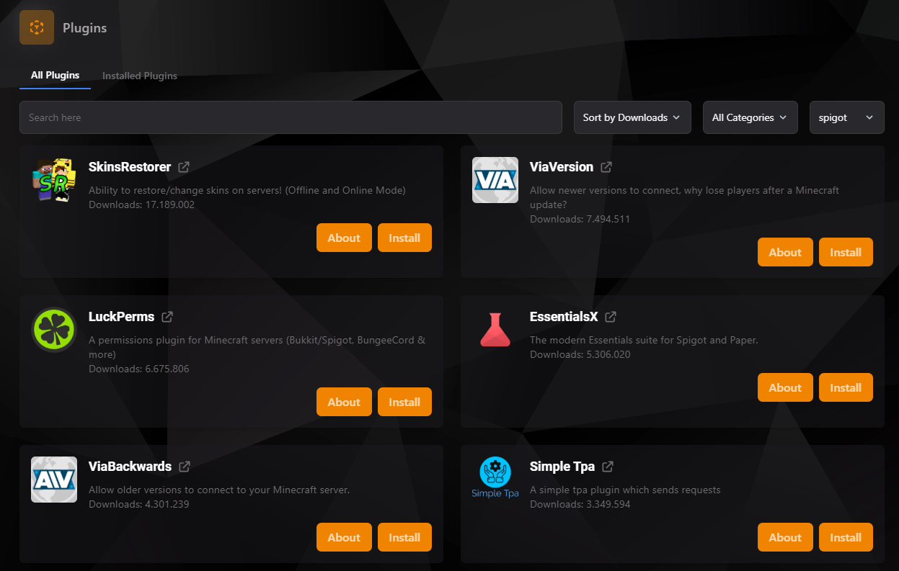
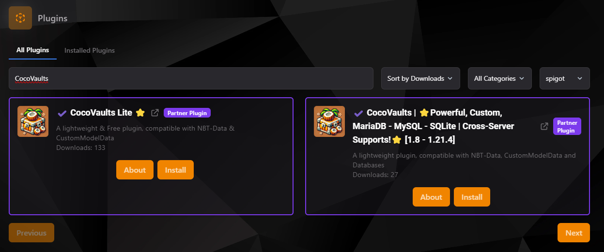

### Plugin Manager en TCP

El **Plugin Manager** del panel TCP facilita la búsqueda, instalación y gestión de plugins para tu servidor de Minecraft. Es una herramienta poderosa para personalizar y mejorar la funcionalidad de tu servidor con solo unos clics.

#### Características Principales

1. **Búsqueda de Plugins**:
    - Utiliza el campo de búsqueda para encontrar plugins específicos.
    - Filtra los resultados por categorías o por plataforma, como Spigot, Bukkit, Paper, entre otros.

2. **Ordenamiento**:
    - Ordena los plugins por el número de descargas, popularidad u otros criterios, según tus necesidades.

3. **Instalación Rápida**:
    - Cada plugin tiene opciones de **"About"** para obtener más información y **"Install"** para instalarlo directamente en tu servidor.

4. **Gestión de Plugins Instalados**:
    - Desde la pestaña **"Installed Plugins"**, puedes ver y gestionar los plugins que ya están instalados en tu servidor.

#### Ejemplo de Plugins Disponibles

- **SkinsRestorer**: Cambia o restaura skins en servidores con modo online o offline.
- **LuckPerms**: Sistema de permisos avanzado compatible con múltiples plataformas.
- **ViaVersion**: Permite a los jugadores de versiones más recientes conectarse a tu servidor sin problemas.
- **EssentialsX**: Proporciona herramientas esenciales para la administración del servidor.
- **Simple Tpa**: Agrega funcionalidad para solicitudes de teletransportación.

#### Busqueda de plugins

Utiliza la herramienta Search para buscar los plugins que necesitas. Podrás buscar tanto en SpigotMC, como en Polymart y Modrith

:::tip
**Nota:** Algunos plugins, como los relacionados con bases de datos o configuraciones avanzadas, pueden requerir configuraciones adicionales después de la instalación.
:::

#### Instalación de un Plugin

1. Selecciona el plugin que deseas instalar.
2. Haz clic en el botón **"Install"**.
3. Sigue las instrucciones adicionales (si las hubiera) para configurarlo en tu servidor.

:::warning
**Recuerda**: No todos los plugins son compatibles con todas las versiones de Minecraft. Asegúrate de verificar la compatibilidad antes de instalar.
:::

#### Gestión de Plugins Instalados

Desde la sección **"Installed Plugins"**, puedes:
- Activar o desactivar plugins.
- Actualizar plugins existentes.
- Eliminar plugins que ya no necesites.