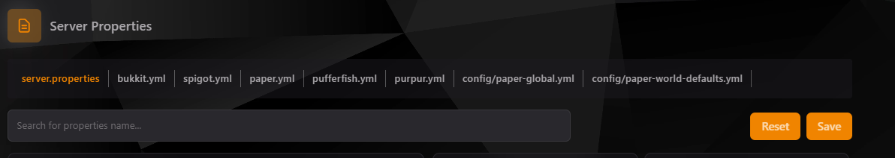

### Configuración de Propiedades del Servidor

La pestaña de **Server Properties** permite realizar configuraciones rápidas y eficientes de los archivos clave de tu servidor, como `server.properties`, `bukkit.yml`, `spigot.yml`, entre otros. Aquí puedes modificar parámetros esenciales directamente desde el panel sin necesidad de acceder al archivo manualmente.

---

### Archivos Disponibles

Los archivos disponibles para configuración dependen del tipo de servidor y las modificaciones instaladas. Algunos de los más comunes incluyen:

1. **server.properties**: Controla configuraciones principales del servidor, como el puerto, nivel de dificultad, entre otros.
2. **bukkit.yml**: Configura opciones específicas de Bukkit, como optimización y comportamiento del mundo.
3. **spigot.yml**: Opciones avanzadas para servidores Spigot, como renderizado de entidades y tiempos de despawn.
4. **paper.yml**: Ajustes adicionales para servidores basados en Paper, optimizados para rendimiento.
5. **purpur.yml**: Configuraciones específicas de Purpur, permitiendo un nivel de personalización aún mayor.
6. **Otros archivos personalizados**: Dependiendo de tu servidor, puedes encontrar archivos como `config/paper-global.yml` o `config/paper-world-defaults.yml` para personalizar configuraciones globales y del mundo.

---

### Cómo Utilizar la Pestaña de Propiedades

1. **Seleccionar el Archivo**: Haz clic en el nombre del archivo que deseas configurar desde la barra superior.
    - Ejemplo: `server.properties`

2. **Buscar Parámetros**: Usa la barra de búsqueda para localizar parámetros específicos.
    - Ejemplo: Busca `max-players` para cambiar el número máximo de jugadores.

3. **Editar Parámetros**: Haz clic en el campo del parámetro que deseas cambiar y ajusta su valor.
    - Ejemplo: Cambia `difficulty=1` (Fácil) a `difficulty=3` (Difícil).

4. **Guardar Cambios**: Una vez que realices las modificaciones, haz clic en el botón **Save** para guardar la configuración.

5. **Restablecer Valores**: Si necesitas volver a los valores por defecto, presiona el botón **Reset**.

---

### Ejemplo: Cambiar Configuración Básica

#### Escenario
Deseas cambiar la dificultad del servidor y el número máximo de jugadores.

#### Pasos
1. Selecciona `server.properties`.
2. Busca:
    - `difficulty` y cámbialo a `3` (Difícil).
    - `max-players` y ajústalo a `50`.
3. Guarda los cambios.

---

### Ventajas de Usar la Pestaña de Propiedades

- **Acceso Rápido**: No necesitas abrir cada archivo manualmente.
- **Intuitivo**: La barra de búsqueda simplifica encontrar parámetros específicos.
- **Seguridad**: Al editar desde el panel, reduces el riesgo de errores en la sintaxis del archivo.

---

### Consejos Adicionales

- **Verifica Compatibilidad**: Asegúrate de conocer el impacto de los cambios realizados, especialmente en servidores con mods o plugins.
- **Respalda Archivos**: Antes de hacer cambios significativos, realiza una copia de seguridad de los archivos por si necesitas restaurarlos.
- **Consulta la Documentación**: Revisa la documentación oficial de tu software de servidor (Bukkit, Spigot, Paper, etc.) para entender mejor cada parámetro.

---