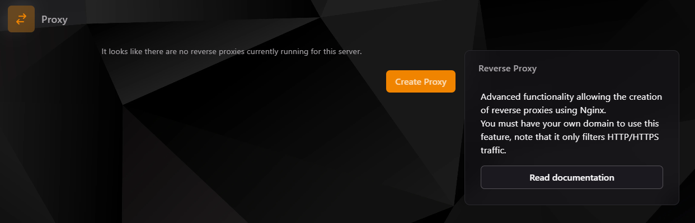

### Proxy Inverso

La sección de Proxy en el panel TCP ofrece una funcionalidad avanzada para la creación de proxies inversos utilizando **Nginx**. Un proxy inverso actúa como intermediario para las solicitudes enviadas a un servidor. En lugar de que el tráfico llegue directamente a tu servidor, primero pasa por el proxy inverso, el cual decide a dónde enviar la solicitud dentro de tu red interna.

#### ¿Por qué usar un Proxy Inverso?

- **Seguridad**: Oculta la dirección IP real de tu servidor y puede agregar capas de seguridad, como SSL.
- **Acceso simplificado**: Convierte una dirección compleja como `http://125.236.25:25569` en algo más sencillo como `https://mapa.miservidor.com`.
- **Gestión eficiente del tráfico**: Permite centralizar el acceso y distribuir las solicitudes de manera más efectiva.

---

#### Cómo configurar un Proxy Inverso

1. **Crear un Proxy**:
    - Haz clic en el botón **Create Proxy**.
    - Completa los campos requeridos:
        - **Proxy Domain**: Especifica el dominio o subdominio que deseas usar (por ejemplo, `mapa.miservidor.com`).
        - **Allocation**: Selecciona el puerto de tu servidor al cual se dirigirá el proxy.

   

2. **Configurar SSL (opcional)**:
    - **Habilitar SSL**: Activa esta opción si deseas que tu proxy funcione sobre una conexión segura.
    - **Lets Encrypt**: Genera automáticamente un certificado SSL para tu proxy. Si usas tu propio SSL, deberás proporcionar el certificado y la clave.

   :::tip
   Si estás utilizando **CloudFlare**, puedes configurar certificados SSL de origen para mejorar la seguridad.
   :::

3. **Finalizar configuración**:
    - Presiona **Create** para guardar los cambios. Ahora, tu proxy estará disponible y podrás acceder a tu servidor utilizando el dominio o subdominio configurado.

---

#### Ejemplo práctico

Si tienes una página web o un plugin como **DynMap**, puedes utilizar el proxy inverso para configurar un acceso fácil y seguro:

**Antes**: `http://125.0.0.1:25569`  
**Después**: `https://mapa.miservidor.com`

---

#### Notas importantes

- El proxy solo filtra tráfico **HTTP/HTTPS**.
- Necesitarás un dominio propio para usar esta funcionalidad.
- Asegúrate de que los DNS de tu dominio apunten al servidor donde se encuentra configurado el proxy.