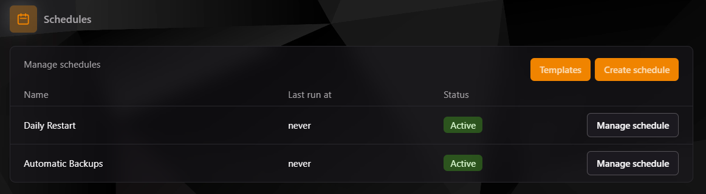
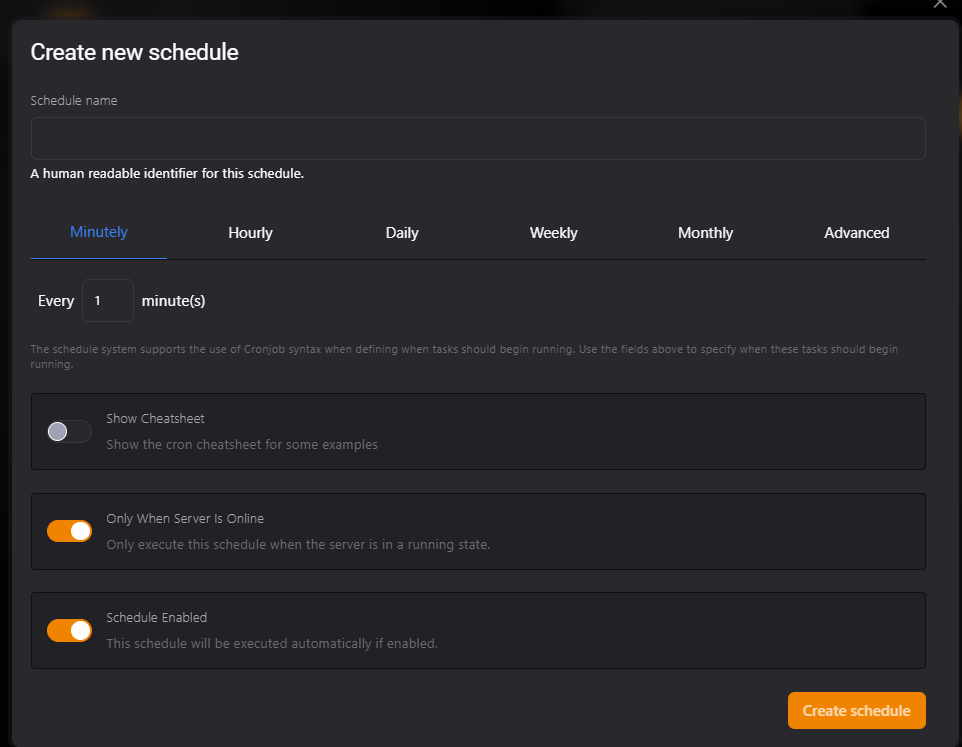

## Planificador de Tareas en TCP

El **Scheduler (Planificador)** en el **Teramont Control Panel (TCP)** permite automatizar tareas en tu servidor, como reinicios programados, copias de seguridad automáticas y ejecuciones periódicas de comandos. Esto te ahorra tiempo y asegura que las tareas críticas se realicen sin intervención manual.

---

### **1. Vista Inicial del Planificador**

En la vista principal del Planificador, puedes:

- **Ver Tareas Existentes:** La lista muestra las tareas creadas, su último tiempo de ejecución, y su estado (activo o inactivo).
- **Crear una Nueva Tarea:** Haz clic en el botón **Create Schedule**.
- **Usar Plantillas:** Accede a configuraciones predefinidas haciendo clic en **Templates**.



---

### **2. Crear una Nueva Tarea Programada**

Para crear una tarea:

1. **Haz clic en "Create Schedule":** Esto abrirá el formulario para configurar una nueva tarea.
2. **Completa los siguientes campos:**
    - **Schedule Name:** Ingresa un nombre para identificar fácilmente la tarea (ejemplo: "Daily Restart").
    - **Intervalo de Tiempo:** Selecciona cómo deseas que la tarea se repita:
        - **Minutely (Cada Minuto)**
        - **Hourly (Cada Hora)**
        - **Daily (Diario)**
        - **Weekly (Semanal)**
        - **Monthly (Mensual)**
        - **Advanced (Personalizado con sintaxis Cron)**

    - **Opciones Adicionales:**
        - **Show Cheatsheet:** Muestra ejemplos de sintaxis Cron para configuraciones avanzadas.
        - **Only When Server Is Online:** Activa esta opción para ejecutar la tarea solo cuando el servidor esté en línea.
        - **Schedule Enabled:** Activa esta opción para que la tarea esté habilitada desde el momento de su creación.

3. **Confirma la Creación:** Haz clic en **Create Schedule** para guardar la tarea.



---

### **3. Gestión de Tareas Programadas**

Una vez creada la tarea, puedes gestionarla desde la lista principal:

- **Ver Detalles:** Haz clic en **Manage Schedule** para editar la configuración o agregar nuevas acciones.
- **Activar/Desactivar:** Cambia el estado de una tarea para activarla o pausarla temporalmente.
- **Eliminar:** Si ya no necesitas una tarea, puedes eliminarla de la lista.

---

### **4. Usos Comunes del Planificador**

- **Reinicios Automáticos:**
  Programa reinicios regulares para liberar memoria y mantener el rendimiento del servidor.
- **Copias de Seguridad Automáticas:**
  Asegúrate de que siempre tengas un respaldo reciente de tu servidor.
- **Ejecución de Comandos:**
  Automatiza tareas administrativas como limpiar archivos temporales o realizar actualizaciones.

---

### **5. Consejos para Configuraciones Avanzadas**

- **Sintaxis Cron:** Si seleccionas la opción **Advanced**, puedes usar la sintaxis de Cron para personalizar completamente los intervalos de tiempo.
    - **Ejemplo:** Para ejecutar una tarea todos los días a las 3:00 AM, usa:
      ```
      0 3 * * *
      ```

- **Prueba tu Configuración:** Antes de confiar completamente en una tarea programada, verifica manualmente que funcione correctamente.

---

### **6. Solución de Problemas**

- **La tarea no se ejecuta:** Verifica que esté habilitada (**Schedule Enabled**) y que el servidor esté en línea si tienes activada la opción **Only When Server Is Online**.
- **Errores en Cron:** Si usas la opción **Advanced**, revisa la sintaxis para asegurarte de que sea válida.
- **Resultados inesperados:** Revisa las acciones configuradas para la tarea y ajusta los intervalos de tiempo si es necesario.

---