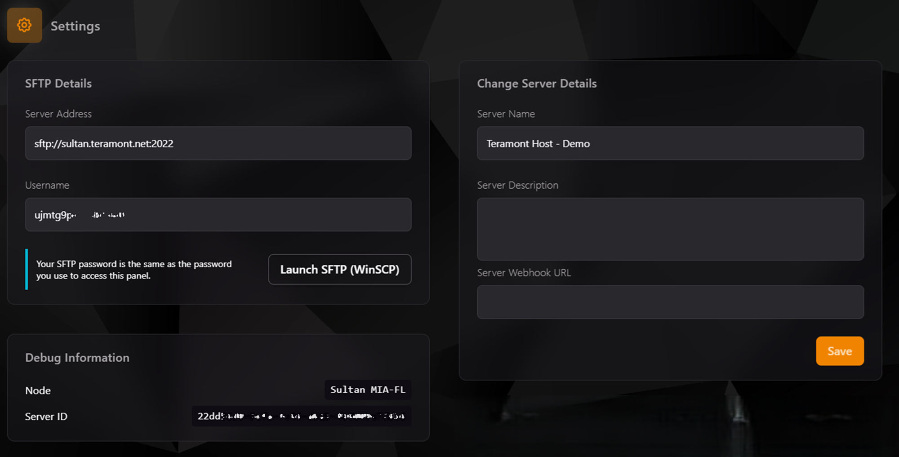
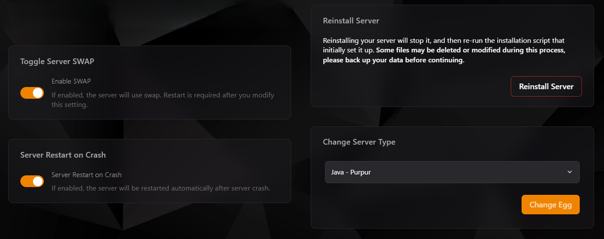

## Configuración del Servidor en el Panel TCP

La pestaña **Configuración** te permite personalizar y administrar aspectos clave de tu servidor. A continuación, te presentamos una guía detallada de todas las funciones disponibles en esta sección.

---

### **1. Detalles de conexión SFTP**

En esta sección, encontrarás la información necesaria para conectarte a tu servidor mediante SFTP (Protocolo de Transferencia de Archivos Seguro):

- **Dirección del Servidor**: La dirección y puerto que debes usar en tu cliente SFTP, como WinSCP o FileZilla.
- **Nombre de Usuario**: El identificador único asignado a tu servidor.
- **Contraseña**: La contraseña utilizada para acceder al panel también funciona para la conexión SFTP.

:::info
**Recomendación:** Usa WinSCP para mayor compatibilidad. Para conectarte, haz clic en el botón "Launch SFTP (WinSCP)".
:::

---

### **2. Información de Depuración**

En esta sección, encontrarás información técnica útil para soporte y diagnóstico:

- **Nodo**: El nombre del nodo en el que está alojado tu servidor.
- **ID del Servidor**: Un identificador único para tu servidor. Es esencial para consultas de soporte técnico.

---

### **3. Cambiar Detalles del Servidor**

Esta sección te permite personalizar aspectos básicos del servidor:

- **Nombre del Servidor**: Cambia el nombre que aparece en tu panel.
- **Descripción del Servidor**: Añade una descripción para identificar el propósito o características de tu servidor.
- **URL de Webhook del Servidor**: Configura un webhook para integraciones con aplicaciones externas.

Haz clic en **Save** para guardar cualquier cambio realizado.

---

### **4. Reinstalar el Servidor**

El botón **Reinstall Server** te permite reinstalar el servidor. Este proceso detendrá el servidor y volverá a ejecutar el script de instalación original.

:::danger
**Advertencia:** Algunos archivos pueden ser eliminados o modificados durante este proceso. Asegúrate de realizar un backup antes de continuar.
:::

---

### **5. Configuración Avanzada**

#### **Habilitar SWAP**
- **Enable SWAP**: Activa el uso de memoria SWAP en el servidor. Este ajuste puede mejorar el rendimiento en situaciones donde la RAM física es limitada.
- **Nota**: El servidor necesita reiniciarse después de modificar esta configuración.

#### **Reinicio Automático al Fallar**
- **Server Restart on Crash**: Habilita esta opción para reiniciar automáticamente el servidor en caso de un fallo.

---

### **6. Cambiar Tipo de Servidor**

En esta sección, puedes cambiar la configuración del tipo de servidor (conocido como "Egg"):

- Selecciona el tipo de servidor en el menú desplegable (por ejemplo, Java - Purpur, Paper, etc.).
- Haz clic en **Change Egg** para aplicar los cambios.

:::info
**Nota:** Cambiar el tipo de servidor puede requerir ajustes adicionales en los archivos de configuración.
:::

---