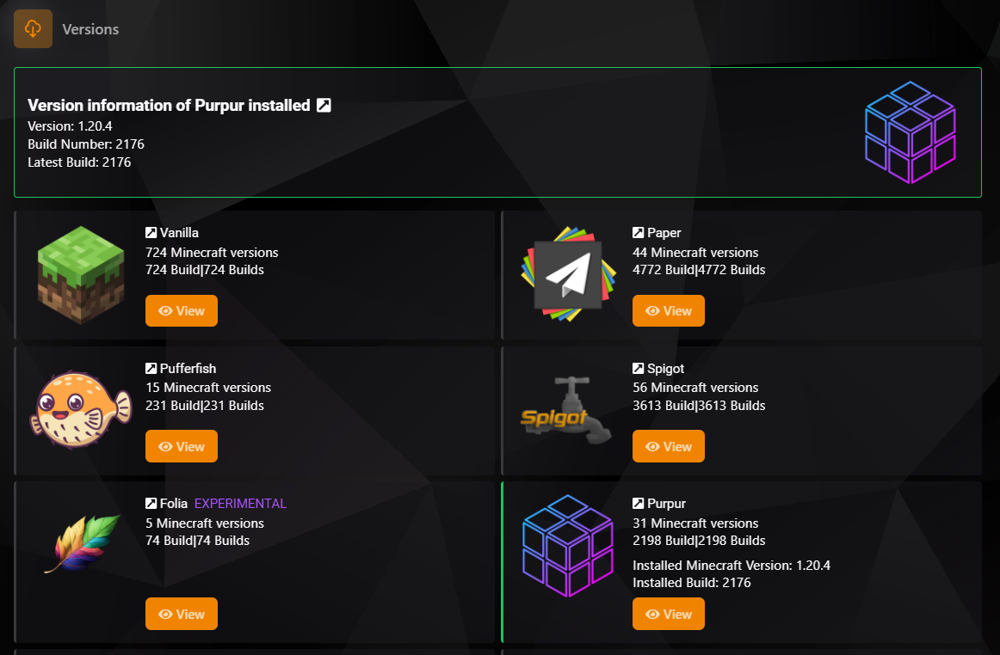
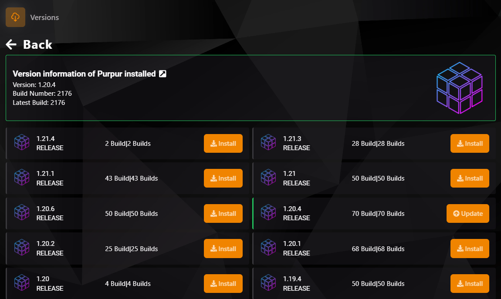
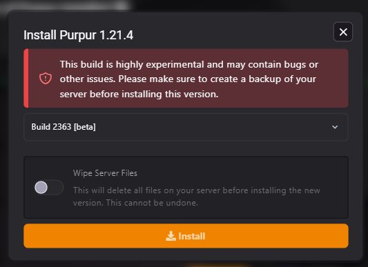
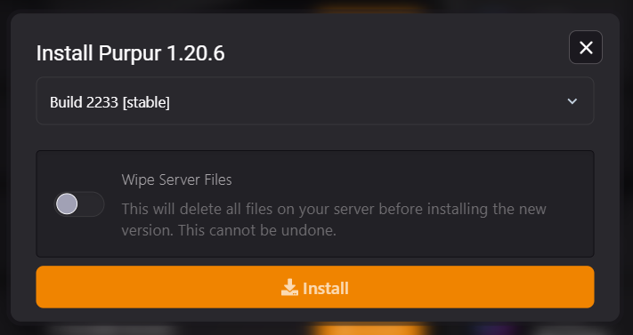

### Selector de Versiones

La sección **Versiones** del panel TCP permite actualizar o cambiar el software de tu servidor de Minecraft de forma sencilla y eficiente. Con una amplia selección de opciones, puedes instalar rápidamente cualquier software compatible.

---

### Tipos de Software Disponibles

| **Software**     | **Estado**   |
|-------------------|--------------|
| **Vanilla**       | Disponible   |
| **Paper**         | Disponible   |
| **Pufferfish**    | Disponible   |
| **Spigot**        | Disponible   |
| **Folia**         | Experimental |
| **Purpur**        | Disponible   |
| **Waterfall**     | Deprecado    |
| **Velocity**      | Disponible   |
| **Fabric**        | Disponible   |
| **BungeeCord**    | Disponible   |
| **Quilt**         | Experimental |
| **Forge**         | Disponible   |
| **NeoForge**      | Disponible   |
| **Mohist**        | Disponible   |
| **Arclight**      | Disponible   |
| **Sponge**        | Disponible   |
| **Leaves**        | Disponible   |
| **Canvas**        | Experimental |

---

### ¿Cómo Usar el Selector?

#### 1. **Seleccionar Software**
Elige el software deseado desde el selector de versiones y presiona el botón **"View"**.

#### 2. **Instalar o Actualizar**
Selecciona la versión deseada y haz clic en **"Install"** o **"Update"** para proceder.

#### 3. **Configurar Opciones**
Opcionalmente, activa **"Wipe Server Files"** si necesitas empezar desde cero.

---

### Precauciones y Consejos

- **Respalda tu servidor antes de realizar cambios** para evitar pérdidas de datos.
- Evita usar versiones **Experimentales** en entornos de producción debido a posibles errores.

---

Este selector facilita enormemente la administración de tu servidor al permitirte cambiar o actualizar versiones de manera rápida y segura.
