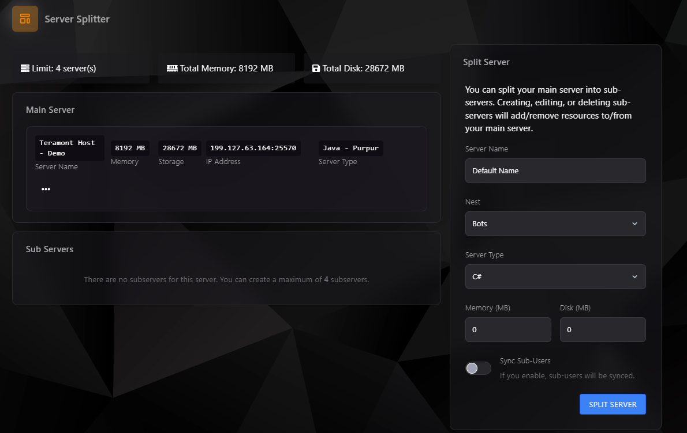

### Introducción al Splitter de Servidores

El **Splitter de Servidores** en el Teramont Control Panel (TCP) permite dividir un servidor principal en subservidores. Esto es útil para distribuir recursos entre diferentes entornos o configuraciones, facilitando la administración y optimización de un único servidor.

:::info 
¡Necesitas un plan Extreme+ de 32 GB o planes performance para poder utilizar el Server Splitter!
:::

---

### Vista General

- **Límite de subservidores**: El sistema soporta hasta 4 subservidores por servidor principal.
- **Memoria Total**: Indica la cantidad total de memoria RAM asignada al servidor principal y sus subservidores.
- **Almacenamiento Total**: Especifica el almacenamiento total disponible para el servidor principal y sus subservidores.

---

### Configuración del Splitter

#### Dividir un Servidor
1. **Server Name**: Asigna un nombre al subservidor.
2. **Nest**: Selecciona la categoría del servidor:
    - **Bots**
    - **Databases**
    - **GameServers**
    - **Minecraft**
    - **Rust**
    - **Voice Servers**
    - **Web Servers**
3. **Server Type**: Selecciona el tipo de servidor dentro de la categoría elegida.
4. **Memory**: Especifica la cantidad de memoria (MB) que deseas asignar al subservidor.
5. **Disk**: Especifica la cantidad de almacenamiento (MB) que deseas asignar al subservidor.
6. **Sync Sub-Users**: Activa esta opción si deseas sincronizar los subusuarios del servidor principal con los del subservidor.
7. Haz clic en **Split Server** para completar la configuración.

---

### Categorías y Tipos de Servidores Disponibles

#### **Bots**
- C#
- Egg Genérico de Javascript
- Golang
- Java
- NodeJS
- Python
- Rust

#### **Databases**
- MariaDB
- Minio S3
- MongoDB
- MongoDB 6
- Postgres
- Redis (5, 6, 7)
- Rethinkdb

#### **GameServers**
- 7 Days To Die
- American Truck Simulator Dedicated Server
- Ark: Survival Evolved
- Counter-Strike: Global Offensive
- Custom Source Engine Game
- Don't Starve Together
- FiveM
- Garry's Mod
- Insurgency
- Left 4 Dead 2
- Palworld (Proton)
- Project Zomboid
- San Andreas - Multiplayer
- Satisfactory
- Team Fortress 2
- tModLoader
- Unturned
- Valheim
- Vintage Story

#### **Minecraft**
- Bedrock (BDSX, GoMint, PowerNukkitX, Vanilla)
- Crossplay (Purpur)
- Java (Arclight, Folia, Forge, Limbo, Paper, Purpur, Vanilla)
- Otros (Nukkit, PocketmineMP)
- Proxy (Bungeecord, GeyserMC, Travertine, Velocity, Waterdog PE, Waterfall)

#### **Rust**
- Rust

#### **Voice Servers**
- IceCast 2
- Lavalink
- Mumble Server
- TeamSpeak3 Server

#### **Web Servers**
- Caddy Server
- Nginx Server
- Uptime Server Kuma
- WebHost Egg 2

---

### Reglas y Restricciones
- **Límite de Subservidores**: Un servidor principal puede dividirse en un máximo de 4 subservidores.
- **Recursos Compartidos**: Los recursos asignados al servidor principal se distribuyen entre sus subservidores. No se pueden superar los límites de memoria y almacenamiento totales.

---

### Ventajas del Splitter de Servidores
- **Flexibilidad**: Permite crear entornos personalizados para diferentes aplicaciones.
- **Optimización**: Facilita la gestión de recursos y asegura un uso eficiente.
- **Colaboración**: Los subservidores pueden ser administrados por diferentes usuarios con permisos personalizados.

Con el Splitter de Servidores, podrás aprovechar al máximo los recursos de tu servidor y administrar múltiples entornos desde un único panel.