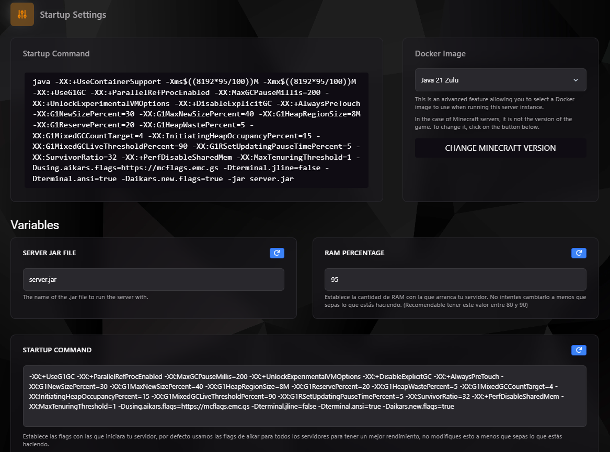

### Configuración de Inicio del Servidor

La configuración de inicio te permite controlar el comportamiento de tu servidor al momento de arrancar. Este apartado es fundamental para ajustar el rendimiento, definir los archivos esenciales y personalizar las variables necesarias para la ejecución.



---

### Secciones Principales de la Configuración de Inicio

#### **1. Comando de Inicio (Startup Command)**
Este comando controla cómo se ejecuta tu servidor, incluyendo el uso de recursos como la memoria RAM y las configuraciones adicionales.

- **Ejemplo de comando (Minecraft Java):**
```bash
java -XX:+UseContainerSupport -Xms${(8192*95/100)}M -Xmx${(8192*95/100)}M -XX:+UseG1GC ...
```

- **Explicación del comando:**
    - **`-Xms` y `-Xmx`:** Establecen el tamaño mínimo y máximo de memoria RAM para el servidor.
    - **`-XX:+UseG1GC`:** Activa el Garbage Collector G1, optimizado para servidores con mucha carga.
    - **`-Dusing.aikars.flags`:** Aplica las flags de Aikar para optimizar el rendimiento en servidores de Minecraft.

:::warning
Modifica este comando únicamente si sabes lo que haces. Cambios erróneos pueden impedir que el servidor inicie correctamente.
:::

---

#### **2. Docker Image**
La imagen de Docker define el entorno base donde corre tu servidor. Puedes seleccionarla para configurar versiones específicas de lenguajes o servicios, como Java.

- **Ejemplo:** `Java 21 Zulu`
- **Nota:** Para servidores de Minecraft, esta opción **no afecta la versión del juego**, sino el entorno de ejecución.

:::tip
Si necesitas cambiar la versión de Minecraft, usa el botón **"Change Minecraft Version"**.
:::

---

#### **3. Variables de Configuración**

##### **Server JAR File**
- **Descripción:** El archivo `.jar` utilizado para ejecutar el servidor.
- **Valor por defecto:** `server.jar`
- **Ejemplo:** Cambia a `forge.jar` si usas Forge en Minecraft.

##### **RAM Percentage**
- **Descripción:** Porcentaje de memoria RAM asignado al servidor.
- **Valor recomendado:** Entre 80% y 95% (dependiendo de la carga del servidor).
- **Ejemplo:** En un servidor con 8 GB, asignar un 90% usa 7.2 GB.

##### **Startup Command Variables (Flags)**
Estas flags definen parámetros avanzados que afectan el rendimiento del servidor:

- **`-XX:+UseG1GC`:** Activa el recolector de basura G1.
- **`-XX:MaxGCPauseMillis=200`:** Reduce el tiempo máximo de pausa para Garbage Collection.
- **`-Xmx` y `-Xms`:** Controlan la memoria asignada.

:::info
Estas configuraciones están optimizadas por defecto, pero puedes personalizarlas para ajustarlas a tus necesidades.
:::

---

### Ejemplo Práctico: Configuración para Minecraft Java

#### **Escenario**
- Servidor con 16 GB de RAM.
- Uso de **Java 21 Zulu**.
- Archivo principal: `server.jar`.

#### **Configuración:**
- **Startup Command:**
```bash
java -Xms${(16384*90/100)}M -Xmx${(16384*90/100)}M -XX:+UseG1GC -XX:MaxGCPauseMillis=200 ...
```
- **Server JAR File:** `server.jar`
- **RAM Percentage:** `90%`

:::tip
Para un servidor con mods pesados, incrementa el tamaño de RAM asignada al 95% y asegúrate de usar flags optimizadas para Garbage Collection.
:::

---

### Problemas Comunes

#### **El servidor no inicia**
1. Revisa que el archivo `.jar` especificado existe en el directorio del servidor.
2. Verifica que las variables de RAM estén dentro de los límites disponibles.
3. Asegúrate de no haber modificado el comando de inicio incorrectamente.

#### **El servidor se crashea bajo carga**
- Considera reducir el **RAM Percentage** para evitar el consumo total de memoria.
- Ajusta las flags de Garbage Collection para tiempos de pausa más largos, si es necesario.

---

### Consejos Finales

1. **Realiza pruebas después de cualquier cambio** para garantizar que el servidor funcione correctamente.
2. **Documenta los cambios realizados** en el comando de inicio para poder revertirlos si algo falla.
3. **Consulta con soporte técnico** si necesitas configuraciones avanzadas o personalizadas.

---