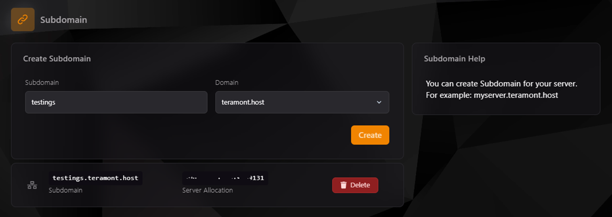

## Subdominios en TCP

El **Teramont Control Panel (TCP)** incluye una opción para que los usuarios configuren subdominios proporcionados por el hosting. Esto les permite asignar un subdominio directamente asociado al servidor, eliminando la necesidad de usar direcciones IP y puertos complejos para acceder a sus servicios.

---

### **1. Crear un Subdominio**

1. **Accede al apartado de Subdominios:**
    - Ve a la sección de **Subdomains** en el TCP.

2. **Completa los campos necesarios:**
    - **Subdomain:** Escribe el prefijo deseado para el subdominio. Este será único dentro del dominio proporcionado por el hosting (por ejemplo: `testings`).
    - **Domain:** Selecciona el dominio disponible proporcionado por el hosting (por ejemplo: `teramont.host`).

3. **Haz clic en "Create":**
    - Una vez confirmado, el sistema generará automáticamente el subdominio (por ejemplo, `testings.teramont.host`) y lo asociará con la asignación de red configurada para tu servidor.

---

### **2. Visualización y Gestión de Subdominios**

Después de crear el subdominio, aparecerá en la lista de subdominios configurados para tu servidor. Cada entrada muestra:

- **Subdomain:** El subdominio completo (ejemplo: `testings.teramont.host`).
- **Server Allocation:** La dirección IP y puerto asociados al subdominio.
- **Delete:** Opción para eliminar el subdominio si ya no es necesario.

---

### **3. Características y Beneficios**

- **Configuración Simplificada:** No es necesario tener conocimientos avanzados sobre DNS. El sistema genera automáticamente los registros necesarios.
- **Acceso Amigable:** Los subdominios permiten que los usuarios se conecten a tu servidor utilizando un nombre claro y fácil de recordar (por ejemplo: `testings.teramont.host`).
- **Integración Completa:** El subdominio queda vinculado directamente con tu servidor y su configuración de red en el TCP.

---

### **4. Casos de Uso Comunes**

- **Servidor Principal:** Usar un subdominio como la principal forma de acceso para usuarios (por ejemplo: `myserver.teramont.host`).
- **Servidor de Pruebas:** Configurar subdominios temporales para pruebas de servicios o configuraciones (por ejemplo: `testings.teramont.host`).
- **Separación de Servicios:** Asignar diferentes subdominios a servidores o propósitos específicos.

---

### **5. Solución de Problemas**

Si experimentas problemas con un subdominio configurado:

1. **Verifica que el subdominio esté listado:** Comprueba que aparece correctamente en la lista del apartado de Subdomains.
2. **Confirma la asignación de red:** Asegúrate de que el subdominio esté vinculado a la IP y puerto correctos.
3. **Propagación DNS:** Aunque el sistema configura automáticamente los registros DNS, podría tardar unos minutos en estar disponible.
4. **Elimina y vuelve a crear:** Si el problema persiste, elimina el subdominio y crea uno nuevo.

---

## Conclusión

La opción de configurar subdominios proporcionados por el hosting en el TCP simplifica el acceso a los servidores y mejora la experiencia del usuario. Aprovecha esta funcionalidad para hacer que tus servicios sean más accesibles y profesionales. Si tienes dudas o inconvenientes, el soporte de **Teramont Host** está siempre disponible para ayudarte.
