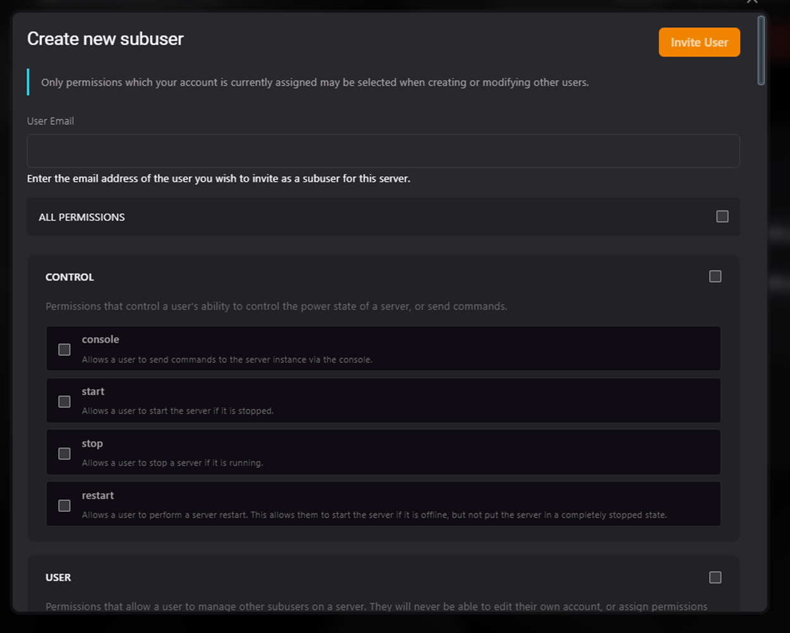

### Introducción a la Administración de Usuarios

La administración de usuarios en el Teramont Control Panel (TCP) permite gestionar subusuarios que pueden acceder y administrar un servidor bajo permisos específicos. Esto garantiza una gestión segura y controlada del servidor.

---

### Gestión de Subusuarios

#### Crear un Nuevo Usuario
1. Haz clic en el botón **New User** en la sección de usuarios.
2. Ingresa el correo electrónico del usuario que deseas invitar como subusuario.
3. Selecciona los permisos que deseas asignar al subusuario.

#### Visualización de Subusuarios
En la tabla principal, se muestra la información básica de los usuarios registrados:
- **Name**: Nombre del subusuario.
- **Email**: Correo electrónico del subusuario.
- **2FA Enabled**: Indica si la autenticación de dos factores está habilitada.
- **Creation Date**: Fecha de creación del subusuario.

---

### Permisos Disponibles

El sistema de permisos está organizado en categorías para facilitar su asignación. Cada categoría agrupa acciones específicas que pueden ser habilitadas o deshabilitadas para un subusuario.

#### Categoría: Control
Permite al usuario realizar acciones básicas de control del servidor.

- **Console**: Enviar comandos a la consola del servidor.
- **Start**: Iniciar el servidor si está detenido.
- **Stop**: Detener el servidor si está en ejecución.
- **Restart**: Reiniciar el servidor.

---

#### Categoría: User
Permite gestionar otros subusuarios del servidor.

- **Create**: Crear nuevos subusuarios.
- **Read**: Ver la lista de subusuarios y sus permisos.
- **Update**: Modificar permisos de subusuarios existentes.
- **Delete**: Eliminar subusuarios.

#### Categoría: Players
Permite la gestión de jugadores conectados al servidor.

- **View**: Ver la lista de jugadores conectados.
- **Kick**: Expulsar jugadores del servidor.
- **Ban**: Prohibir el acceso de jugadores al servidor.
- **Unban**: Revocar prohibiciones a jugadores.

---

#### Categoría: File
Permite realizar acciones en el sistema de archivos del servidor.

- **Create**: Crear nuevos archivos y carpetas.
- **Read**: Ver el contenido de directorios (sin descargar archivos).
- **Read-Content**: Ver y descargar el contenido de archivos.
- **Update**: Modificar archivos existentes.
- **Delete**: Eliminar archivos o carpetas.
- **Archive**: Comprimir y descomprimir archivos.
- **Git**: Gestionar acciones de Git en el administrador de archivos.
- **Download**: Descargar archivos desde URL.
- **SFTP**: Conectar y gestionar archivos mediante SFTP.

---

#### Categoría: Properties
Permite gestionar las propiedades del servidor.

- **Manage**: Cargar y guardar configuraciones en el menú de propiedades del servidor.

#### Categoría: Votifier
Permite enviar votos de prueba al servidor.

- **Test-Vote**: Enviar votos de prueba.

---

#### Categoría: Backup
Permite gestionar las copias de seguridad del servidor.

- **Create**: Crear nuevas copias de seguridad.
- **Read**: Ver las copias de seguridad existentes.
- **Delete**: Eliminar copias de seguridad.
- **Download**: Descargar copias de seguridad.
- **Restore**: Restaurar el servidor desde una copia de seguridad.

---

#### Categoría: Allocation
Permite gestionar las asignaciones de puertos para el servidor.

- **Read**: Ver las asignaciones actuales.
- **Create**: Asignar nuevos puertos.
- **Update**: Cambiar la asignación principal o agregar notas.
- **Delete**: Eliminar asignaciones existentes.

#### Categoría: Subdomain
Permite gestionar los subdominios asignados al servidor.

- **Manage**: Crear y eliminar subdominios.

---

#### Categoría: Proxy
Permite gestionar los proxies del servidor.

- **Create**: Crear nuevos proxies.
- **Delete**: Eliminar proxies existentes.

#### Categoría: Firewall
Permite gestionar las reglas del firewall del servidor.

- **Manage**: Ver, crear y eliminar reglas.

#### Categoría: Startup
Permite gestionar las variables de inicio del servidor.

- **Read**: Ver las variables de inicio.
- **Update**: Modificar las variables de inicio.
- **Docker-Image**: Cambiar la imagen de Docker utilizada.

---

#### Categoría: Database
Permite gestionar las bases de datos asociadas al servidor.

- **Create**: Crear nuevas bases de datos.
- **Read**: Ver las bases de datos existentes.
- **Update**: Rotar contraseñas de bases de datos.
- **Delete**: Eliminar bases de datos.
- **Export**: Exportar bases de datos.
- **Import**: Importar bases de datos.
- **Clear**: Limpiar bases de datos.
- **View_Password**: Ver la contraseña de las bases de datos.
- **View_on_phpMyAdmin**: Ver bases de datos en phpMyAdmin.
- **Backup**: Gestionar copias de seguridad de las bases de datos.

---

#### Categoría: Schedule
Permite gestionar tareas programadas en el servidor.

- **Create**: Crear nuevas tareas.
- **Read**: Ver tareas existentes.
- **Update**: Modificar tareas existentes.
- **Delete**: Eliminar tareas programadas.

#### Categoría: Splitter
Permite gestionar divisiones del servidor.

- **Manage**: Crear y eliminar subservidores.

---

### Configuración (Settings)

Este grupo de permisos controla el acceso de un subusuario a las configuraciones avanzadas del servidor.

#### Permisos Disponibles:
- **Rename**: Permite renombrar el servidor y cambiar su descripción.
- **Reinstall**: Autoriza al usuario a reinstalar el servidor.
- **Swap**: Habilita la activación/desactivación del uso de memoria swap.
- **Crash**: Permite alternar el reinicio automático en caso de fallo.
- **Change-Egg**: Da la posibilidad de cambiar el tipo de Egg del servidor.

### Actividad (Activity)

Este permiso se enfoca en el acceso al registro de actividades del servidor, donde se detallan las acciones realizadas por los usuarios.

#### Permiso Disponible:
- **Read**: Permite al usuario visualizar los registros de actividad del servidor.

---