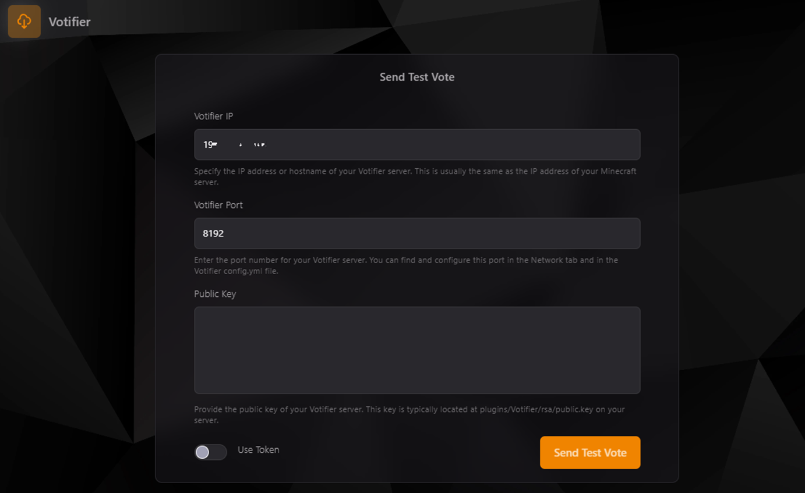

### Configuración y Prueba de Votifier

El apartado **Votifier** permite probar si tu servidor está configurado correctamente para recibir votos desde páginas de votación, asegurando que los jugadores reciban recompensas o notificaciones en el servidor.

---

### Campos de Configuración

1. **Votifier IP**:
    - Introduce la dirección IP o el hostname de tu servidor donde se encuentra configurado Votifier. Esto suele coincidir con la dirección IP del servidor de Minecraft.
    - Ejemplo: `198.51.100.1`

2. **Votifier Port**:
    - Especifica el puerto utilizado por tu servidor Votifier. Este puerto debe coincidir con el configurado en el archivo `config.yml` de Votifier.
    - Ejemplo: `8192`

3. **Public Key**:
    - Introduce la clave pública de tu configuración de Votifier. Este archivo generalmente se encuentra en `plugins/Votifier/rsa/public.key`.

4. **Use Token**:
    - Activa esta opción si tu sistema de Votifier utiliza tokens para la autenticación en lugar de claves públicas.

---

### Cómo Realizar una Prueba de Votifier

1. Completa los campos de configuración mencionados anteriormente:
    - IP del servidor Votifier.
    - Puerto configurado en Votifier.
    - Clave pública del archivo `public.key` (si es necesario).

2. Activa la opción "Use Token" solo si tu configuración requiere tokens.

3. Haz clic en **Send Test Vote** para enviar una prueba de voto.

4. Revisa la consola de tu servidor para confirmar que se recibió correctamente el voto.

---

### Solución de Problemas

#### Error: "Vote Not Received"
- **Verifica la Conexión**: Asegúrate de que el puerto especificado en Votifier esté abierto en el firewall.
- **Revisa el Archivo Config**: Confirma que el archivo `config.yml` de Votifier tenga configurados correctamente la IP, el puerto y las claves.

#### Error: "Invalid Key"
- Asegúrate de que estás utilizando la clave pública correcta del archivo `public.key`.

#### No Recibes Votos
- Asegúrate de que las páginas de votación estén configuradas para enviar votos a la dirección IP y puerto correctos.

---