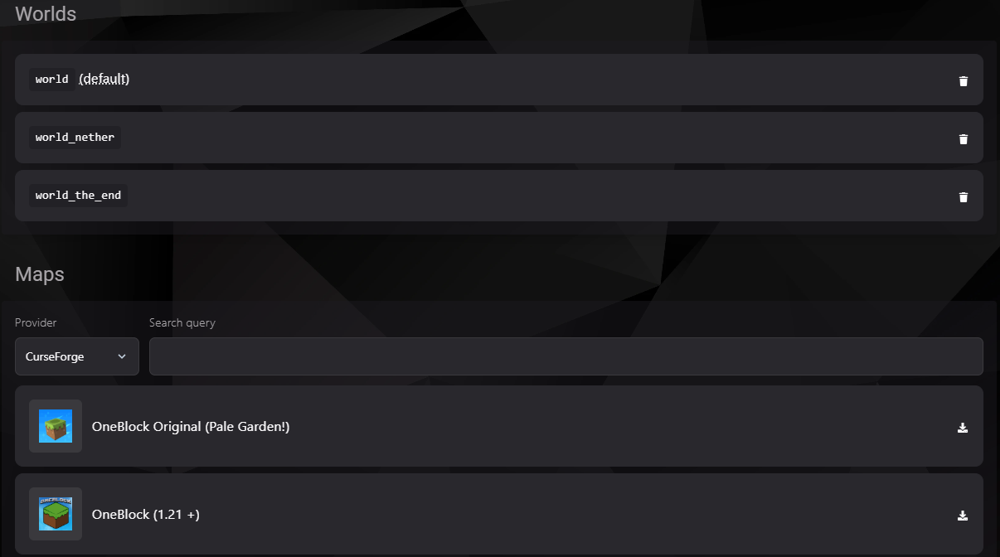

### World Manager en TCP

El **World Manager** del panel TCP te permite gestionar y explorar los mundos de tu servidor de Minecraft con facilidad. Esta herramienta combina funciones avanzadas para administrar mundos existentes y descargar mapas personalizados directamente desde proveedores confiables.

---

#### Gestión de Mundos

1. **Lista de Mundos Existentes**:
    - Los mundos actuales de tu servidor se muestran en la parte superior de la sección.
    - Los mundos predeterminados incluyen:
        - **world (default)**
        - **world_nether**
        - **world_the_end**

2. **Eliminar Mundos**:
    - Haz clic en el icono de papelera junto al nombre del mundo que deseas eliminar.
    - **Advertencia**: Esta acción es irreversible. Asegúrate de hacer una copia de seguridad antes de proceder.

---

#### Descarga de Mapas Personalizados

1. **Selección del Proveedor**:
    - Puedes seleccionar mapas de plataformas como **CurseForge**, donde hay una amplia variedad de opciones.

2. **Búsqueda de Mapas**:
    - Usa el campo de búsqueda para encontrar mapas específicos por nombre o tema.

3. **Descarga de Mapas**:
    - Una vez encontrado el mapa deseado, haz clic en el botón de descarga (ícono de flecha hacia abajo) para agregarlo a tu servidor.

4. **Ejemplo de Mapas**:
    - **OneBlock Original (Pale Garden!)**
    - **OneBlock (1.21 +)**

---

#### Consejos de Uso

- **Copia de Seguridad**: Antes de añadir o eliminar mundos, siempre realiza una copia de seguridad de tu servidor para evitar pérdidas de datos importantes.
- **Mapas Personalizados**: Los mapas personalizados pueden agregar una experiencia única para tus jugadores. Asegúrate de verificar la compatibilidad con la versión de Minecraft de tu servidor antes de descargarlos.