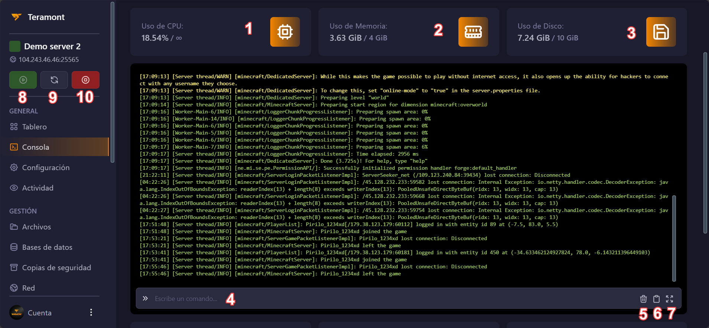

## Controles básicos del panel en la sección "Consola"

A continuación, te presentamos una guía visual de los controles básicos que encontrarás en la sección "Consola" de nuestro panel:

:::info
**Descripción de los controles:**

1. **Uso del CPU**: Muestra en tiempo real el consumo de CPU de tu servidor.
2. **Uso de RAM**: Indica en tiempo real la memoria RAM utilizada por tu servidor.
3. **Uso de almacenamiento**: Muestra en tiempo real el espacio de almacenamiento utilizado por tu servidor.
4. **Centro de comandos**: Desde aquí, puedes enviar comandos directamente a la consola de tu servidor.
5. **Limpiar consola**: Este botón te permite limpiar la consola para una mejor visualización.
6. **Copiar registros**: Este botón te permite copiar las ultimas lineas de la consola a [mclo.gs](https://mclo.gs) de forma automática.
5. **Expandir consola**: Este botón te permite abrir la consola en una pestaña nueva.
:::

## Centro de control

:::info
**⚠️ Esta sección siempre esta visible en el panel ⚠️**

**Descripción de los controles:**

8. **Iniciar servidor**: Utiliza este botón para encender tu servidor.
9. **Reiniciar servidor**: Permite reiniciar tu servidor.
10. **Apagar/Forzar cierre**: Utiliza este botón para apagar o forzar el cierre de tu servidor.
:::